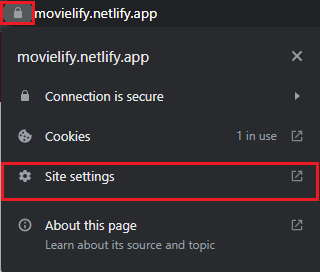
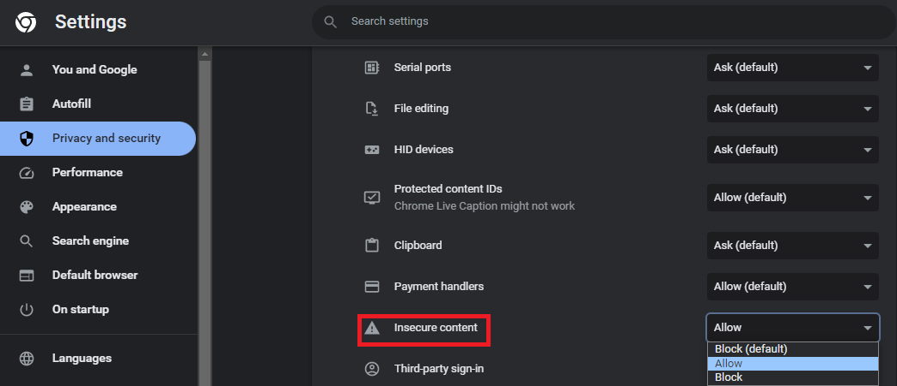

:construction: Site in construction :construction:

Due to the API URL uses the **HTTP** protocol, for most of browsers is not secure and the APP is not going to run.
To fix this, I recommend you to follow the next steps:
1) Copy and paste this link into your browser: https://movielify.netlify.app
2) Click in the padlock and click "Site settings"

3) Find "Insecure content" and select "Allow"

4) Go back to the site and press F5 (refresh the page). Now your browser is going to run the site :smile:
### :memo:To log in the app, use the following credentials:
- <em> Email: challenge@alkemy.org </em>
- <em> password: react </em>
